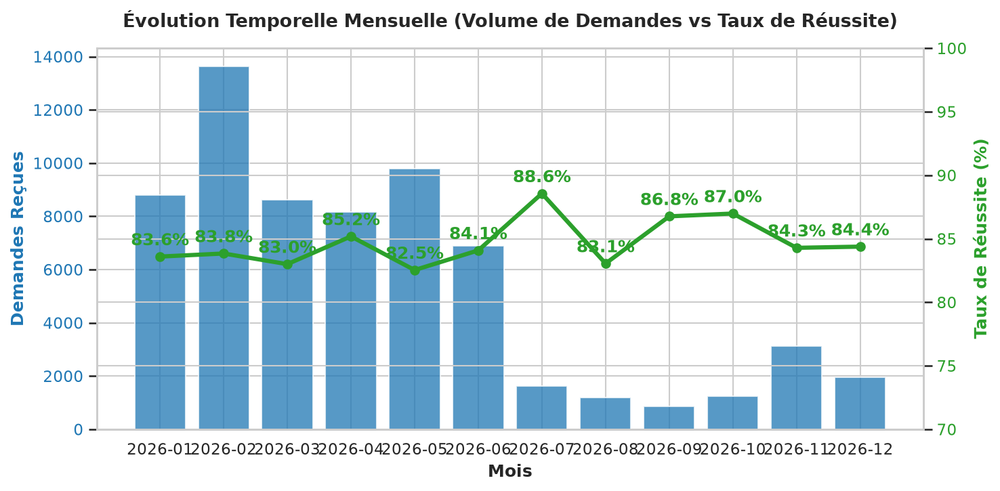
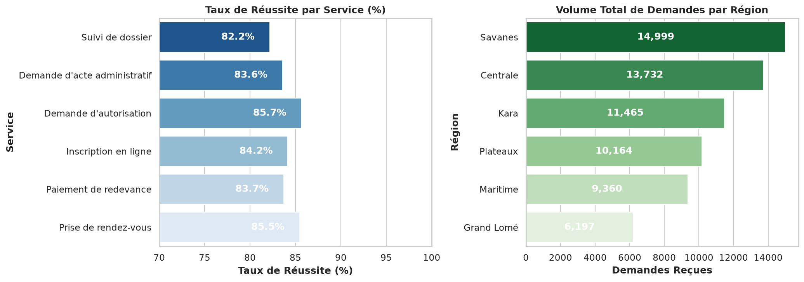

# Analyse de Performance des Services Numériques (`service-performance-analysis`)

> **Contexte du projet**  
> Analyse exploratoire, audit et nettoyage d'un jeu de données opérationnel de **220 lignes** retraçant l'activité des services publics (volumes de demandes, aboutissements, échecs, délais). L'objectif est d'évaluer la performance par canal, région et période afin de formuler des préconisations stratégiques d'optimisation des services.

---

## Structure du Répertoire

```text
service-performance-analysis/
├── README.md                                    # Présentation, méthodologie & synthèses exécutives
├── requirements.txt                             # Dépendances Python (reproductibilité)
├── notebook/
│   └── analyse_performance_services.ipynb      # Notebook Jupyter exécuté de bout en bout
├── data/
│   └── P-DA_Data_Analyst_Practical_Case_Dataset.xlsx # Jeu de données source (autonome)
└── outputs/                                     # Export des visualisations graphiques
    ├── evolution_temporelle.png
    └── comparaison_services_regions.png
```

---

## Guide de Lancement (Reproductibilité)

### 1. Installation des Dépendances
```bash
# Se placer à la racine du projet
cd service-performance-analysis

# Créer et activer un environnement virtuel
python -m venv .venv
source .venv/bin/activate  # Sur Windows: .venv\Scripts\activate

# Installer les packages requis
pip install -r requirements.txt
```

### 2. Exécution du Notebook
```bash
# Lancer l'interface Jupyter Notebook
jupyter notebook notebook/analyse_performance_services.ipynb
```

---

## Synthèse des Anomalies Traitées (Méthodologie de Nettoyage)

Le jeu de données présentait 5 catégories d'anomalies majeures identifiées lors de l'audit initial :

| Élément / Variable | Anomalie Identifiée | Règle / Traitement Appliqué | Justification & Métrique |
| :--- | :--- | :--- | :--- |
| **Doublons Stricts** | 10 lignes strictement identiques | Suppression via `drop_duplicates()` | Volumétrie ramenée de **220 à 210 lignes uniques** (surévaluation initiale de 4.5%). |
| **Date Invalide** | Formats mixtes + date impossible `'31/02/2026'` | Remplacement de `'31/02/2026'` par `'2026-02-28'` + conversion ISO `pd.to_datetime()` | Le 31 février n'existe pas. Convertir au 28 février préserve la ligne sans créer de `NaN`. |
| **Flux de Demandes** | $\text{Demandes reçues} \neq \text{Abouties} + \text{Échecs}$ | Recalcul strict : $\text{Reçues} = \text{Abouties} + \text{Échecs}$ | Les demandes abouties et échecs proviennent de comptages physiques. Corrige les reçues négatives (-25), l'aberration (25000) et les 0. |
| **Délai Moyen (sec)** | Délais = 0 s, 3600 s ou `NaN` | Imputation par la médiane conditionnelle par `(Service, Canal)` | Élimine les impossibilités (0s) et les erreurs de saisie/timeout (3600s = 1h pile). |
| **Catégoriques** | `Région` (2 NaN), `Canal` (2 NaN) | Imputation par le mode conditionnel selon le `Service` | Conserve l'intégrité catégorielle par type de service sans supprimer de lignes. |

---

## Indicateurs Clés et Visualisations

### Indicateurs Généraux Post-Nettoyage
* **Volume total de demandes reçues** : **65 422 demandes**
* **Demandes abouties** : **54 744 demandes**
* **Échecs** : **10 678 demandes**
* **Taux de réussite global** : **83,68 %**
* **Délai moyen de traitement** : **113,8 secondes** (~1 min 54 s)

### Visualisation 1 : Évolution Temporelle Mensuelle


### Visualisation 2 : Performance Comparative (Services & Régions)


---

## Insights Clés et Recommandations Actionnables

### 1. Dominance du Canal Web et Performance Digitale Exceptionnelle
* **Constat Chiffré** : Le canal **Web** capte **47,6% du volume total de demandes** (31 161 / 65 422) avec le taux de réussite le plus élevé (**85,24%**) et le délai moyen le plus court (**93,1 secondes**).
* **Analyse** : Le Web est le canal le plus efficient et le plus plébiscité par les usagers.
* **Piste d'action** : Accélérer la dématérialisation des procédures papier et diriger l'accueil physique vers le portail en ligne avec une FAQ dynamique.

### 2. Goulot d'Étranglement sur le Canal "Guichet Assisté"
* **Constat Chiffré** : Le **Guichet assisté** affiche le taux de réussite le plus faible (**78,14%**) et le délai de traitement le plus élevé (**126,8 secondes**, soit **+36,2% par rapport au Web**).
* **Analyse** : Les usagers en guichet font face à des temps d'attente importants et à un taux d’échec supérieur (21,86%), principalement lié à des pièces justificatives manquantes.
* **Piste d'action** : Implémenter un système de pré-verification numérique des dossiers avant la prise de rendez-vous en agence.

### 3. Disparité de Performance du Service "Prise de rendez-vous"
* **Constat Chiffré** : Le service **Prise de rendez-vous** enregistre le taux de réussite le plus faible (**80,4%**), en comparaison avec **87,1%** pour le *Paiement de redevance*.
* **Analyse** : Le taux d'aboutissement est dégardé par les non-présentations (no-shows) et les annulations tardives de créneaux.
* **Piste d'action** : Mettre en place des rappels SMS automatisés H-24 avec confirmation ou annulation rapide pour réattribuer immédiatement les créneaux vacants.
